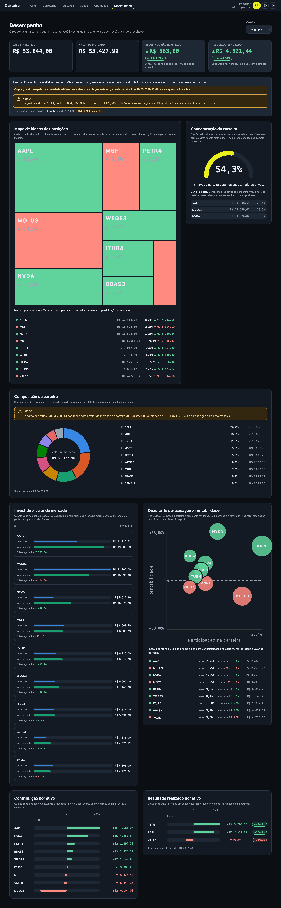
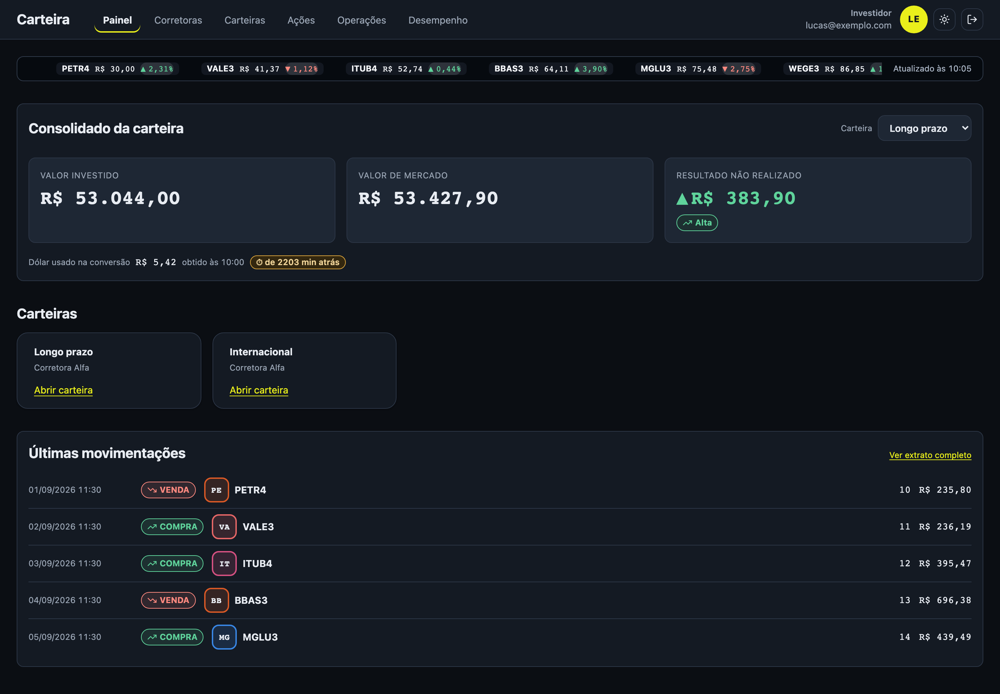
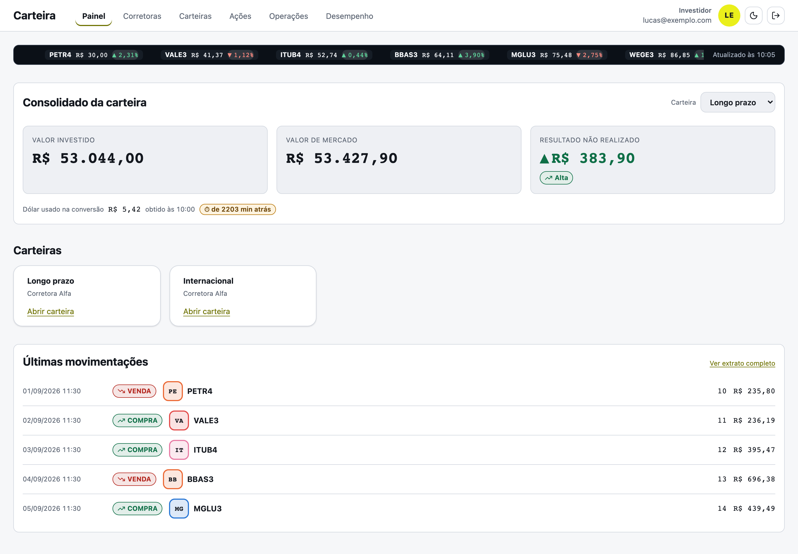
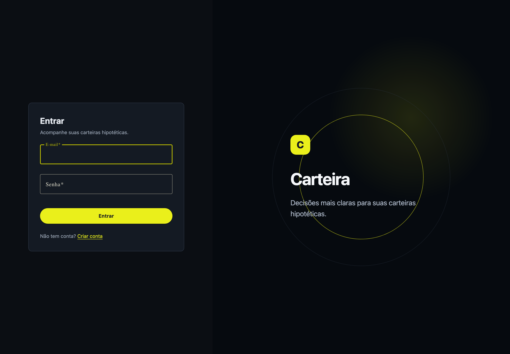
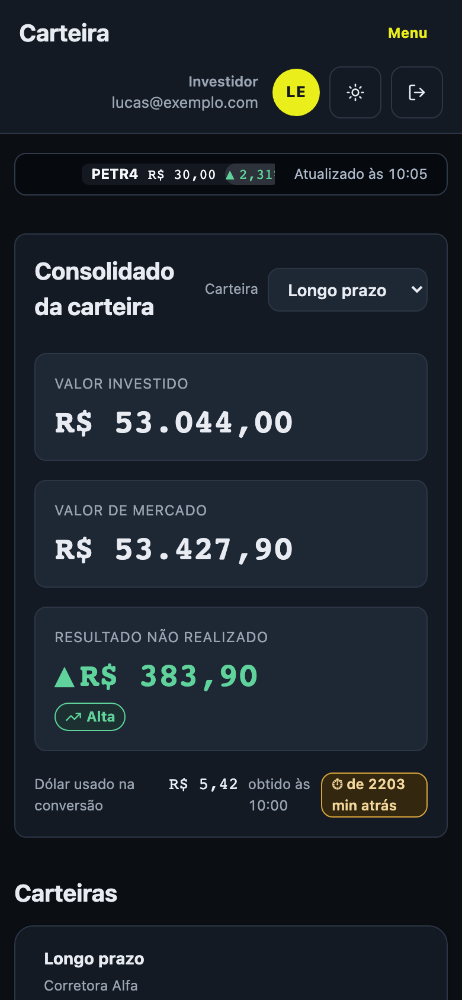

# Carteira — frontend

Aplicação web onde o investidor monta **carteiras hipotéticas de ações**, registra
compras e vendas a preço de mercado e acompanha como essas carteiras se comportam.
Nada de dinheiro real: não há saldo, depósito, ordem enviada a corretora nem
custódia espelhada.

O produto responde a uma pergunta só: **"o que aconteceria se eu montasse esta
carteira?"**

Testar uma tese de investimento hoje custa dinheiro real ou dá trabalho manual.
Planilha não atualiza preço sozinha, e as ferramentas de mercado analisam ativos
individuais, não uma carteira montada agora. Este projeto junta carteira, preço de
mercado real e histórico de movimentações num lugar só.

---

## Telas

### Desempenho

O destino do fluxo: sete gráficos em SVG próprio, sem biblioteca de gráficos.
Mapa de blocos das posições, medidor de concentração, composição em rosca,
investido × valor de mercado, quadrante participação × rentabilidade,
contribuição por ativo e resultado realizado.



### Painel

Faixa de cotações, consolidado da carteira escolhida, cartões das carteiras e as
últimas movimentações.



### Tema claro

Os dois temas são obrigatórios e nenhuma informação depende só de cor: ganho e
perda têm sinal e seta além do verde e do vermelho.



### Acesso e celular

O piso de tela é 360px. A navegação vira menu compacto, as tabelas rolam dentro do
próprio bloco e os gráficos empilham em coluna única.

| Login | Celular (390px) |
|---|---|
|  |  |

---

## O que o produto deixa claro o tempo todo

Três verdades atravessam todas as telas, e nenhuma delas fica escondida num
rodapé:

1. **O preço na tela não é ao vivo.** Toda cotação vem com o momento em que foi
   obtida. Número sem hora é tela incompleta.
2. **A rentabilidade ignora dividendos e JCP.** O produto não tem esse dado, e um
   ativo que distribuiu dinheiro aparece com resultado menor do que o real. Isso
   está dito na tela de desempenho, onde o número é lido.
3. **Fonte externa cai e a tela continua.** Dado externo que falha vira último
   valor conhecido mais um aviso, nunca uma tela de erro.

Há também uma restrição que molda todos os gráficos: **o produto não guarda série
histórica**. Não existe evolução ao longo do tempo, rentabilidade por mês nem
comparação com índice. Todo gráfico é um retrato do agora. Isso não é lacuna a
preencher — é a fronteira do que o produto pode afirmar com honestidade.

---

## Tecnologias

| Camada | O que é usado |
|---|---|
| Framework | Angular 22, componentes standalone, signals, `ChangeDetectionStrategy.OnPush` |
| Linguagem | TypeScript 6 |
| Estilo | SCSS por componente, tokens em `src/styles/_tokens.scss` |
| Componentes | Angular Material 22 + CDK, ícones Lucide |
| Tabelas | TanStack Table (Angular) |
| HTTP | `HttpClient` com interceptors de sessão e de erro |
| Testes | Vitest + jsdom — 98 arquivos de spec |
| Verificação visual | Playwright (capturas e medição de contraste e responsividade) |
| Empacotamento | Docker multi-stage — Node compila, nginx serve |

Não há biblioteca de gráficos: os sete gráficos do desempenho são SVG desenhado à
mão, o que mantém o bundle enxuto e o controle de acessibilidade nas nossas mãos.

---

## Como rodar

### Com Docker (sobe o sistema inteiro)

O `docker-compose.yml` vive no repositório do backend e sobe banco, API e frontend
juntos:

```bash
git clone git@github.com:lucassm-dev/api-externa-backend-v1.git
cd api-externa-backend-v1
cp .env.example .env        # preencha as chaves e o caminho do frontend
docker compose up --build
```

- Frontend: http://localhost:8081
- API e Swagger: http://localhost:8080/swagger-ui.html

Só a imagem do frontend, contra um backend que já esteja no ar:

```bash
docker build -t investimentos-web .
docker run --rm -p 8081:80 -e BACKEND_URL=http://host.docker.internal:8080 investimentos-web
```

### Em desenvolvimento

Precisa do backend rodando em `localhost:8080`:

```bash
npm install
npm start           # ng serve com proxy → http://localhost:4200
```

```bash
npm test            # suíte completa (Vitest)
npm run build       # bundle de produção em dist/
```

---

## Como o frontend fala com a API

O código Angular chama **caminho relativo** — `/auth`, `/investidores`,
`/corretoras`, `/carteiras`, `/acoes`, `/operacoes`, `/mercado`. Não existe URL
base configurável, e isso é proposital: quem resolve o endereço é a camada de
fora.

- Em desenvolvimento, o `proxy.conf.json` repassa esses prefixos para
  `localhost:8080`.
- Em container, o nginx da imagem faz o mesmo repasse para o backend.

O efeito é que **a API responde sempre na mesma origem do SPA**, e com isso o CORS
deixa de existir em vez de virar mais uma coisa a configurar por ambiente.

> Mexeu nos prefixos do `proxy.conf.json`? Mexa também em
> `nginx/padrao.conf.template`. Divergir entre os dois cria um caminho que
> funciona no `ng serve` e devolve 404 no container.

---

## Organização do código

```
src/app/
  core/        sessão, erros, formatação, tema, acesso a dados
  layout/      casca do produto: topo, navegação, menu compacto
  shared/      botão, selo, tabela, paginador, estado vazio, monograma…
  features/
    acesso/        login e cadastro
    painel/        tela inicial, faixa de cotações, consolidado
    corretoras/    catálogo de corretoras
    carteiras/     carteiras, posições, movimentações
    acoes/         catálogo de ações
    operacoes/     compra, venda e extrato
    desempenho/    números e os sete gráficos
src/styles/    tokens de cor e escalas (único lugar onde cor é escrita)
```

---

## Como este projeto é desenvolvido

O repositório é **spec-anchored**: a especificação é auditada mecanicamente contra
o código, e não confiada. Em `.spec/` moram as features, cada uma com histórias de
usuário, critérios de aceite e tarefas rastreadas.

Cada critério de aceite vira um teste anotado com `@spec:AC-xxx` no título, e uma
feature só fecha quando a auditoria sai limpa:

```bash
node .claude/skills/onp-spec-driven/scripts/onp-spec.mjs audit --ci
```

Há ainda uma **constituição** em `.spec/constituicao.md` com princípios
verificados por regex sobre o código — por exemplo, nenhuma cor literal fora de
`_tokens.scss`, e nenhum tratamento de erro que compare o texto da mensagem do
servidor em vez do código.

Decisões de produto e de arquitetura ficam em `docs/prd/`, `docs/adr/` e
`docs/rfc/`.

---

## Acessibilidade

- Contraste conferido nos dois temas, em par texto/fundo declarado em token.
- Nada é comunicado só por cor: ganho e perda têm sinal e seta, dado defasado tem
  marcação própria.
- Paleta de séries com ordem fixa, validada para daltonismo — a fatia de um ativo
  não muda de cor porque outro entrou ou saiu.
- Gráficos navegáveis por teclado, com o mesmo detalhe que o ponteiro revela.
- Movimento respeita `prefers-reduced-motion`.
- Alvo de toque de 44px onde o ponteiro é grosso.

---

## Backend

Este repositório é só o frontend. A API vive em
[api-externa-backend-v1](https://github.com/lucassm-dev/api-externa-backend-v1) —
Java 21, Spring Boot 3.3, PostgreSQL com Flyway, autenticação por JWT.

---

## Autor

**Lucas Mendes** — [@lucassm-dev](https://github.com/lucassm-dev)
